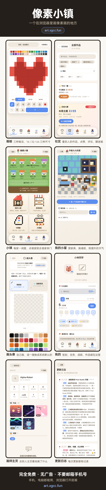
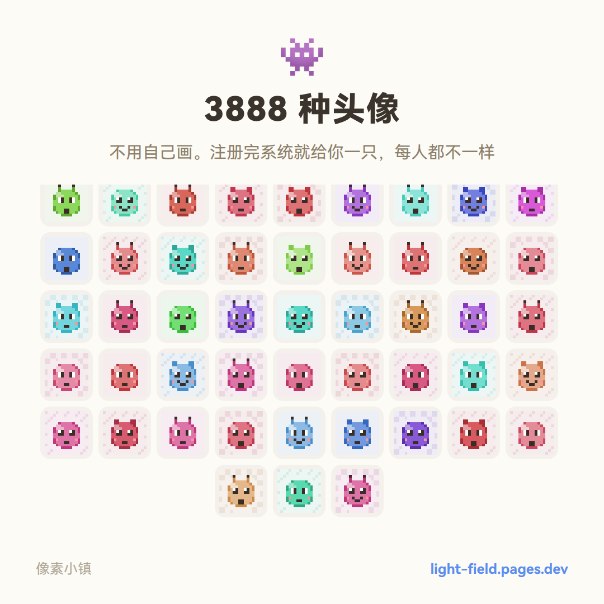
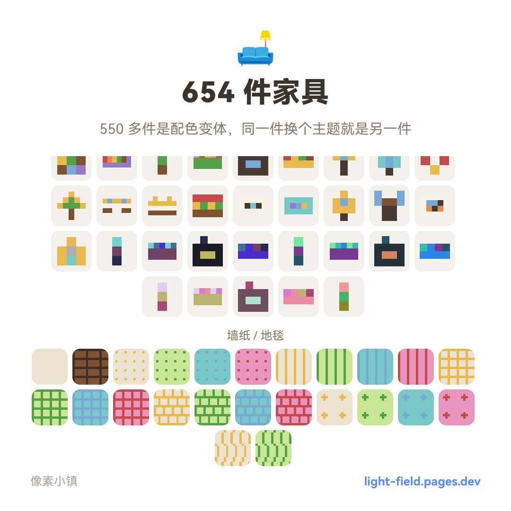
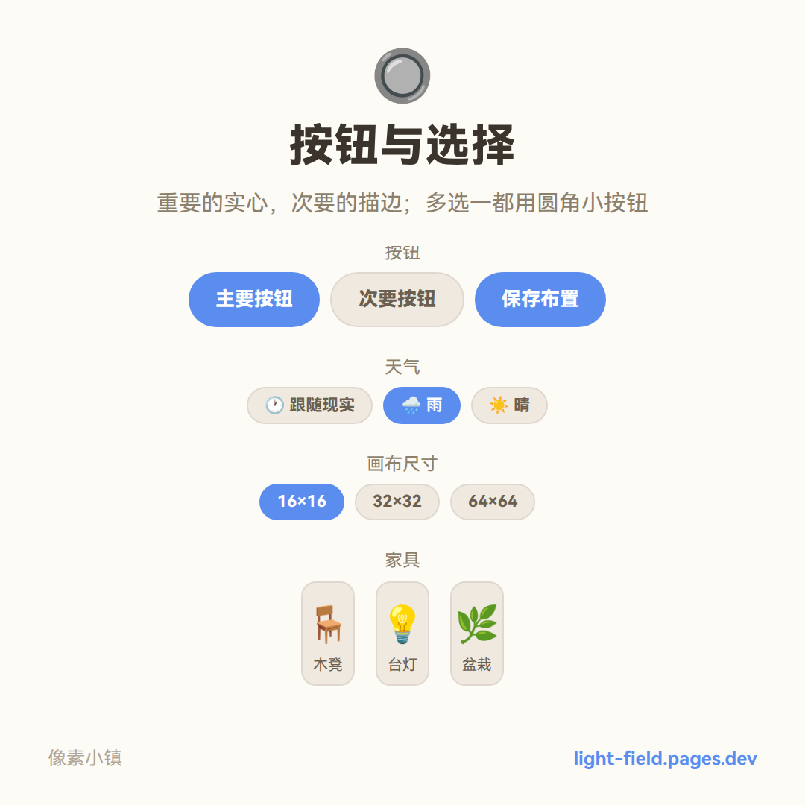
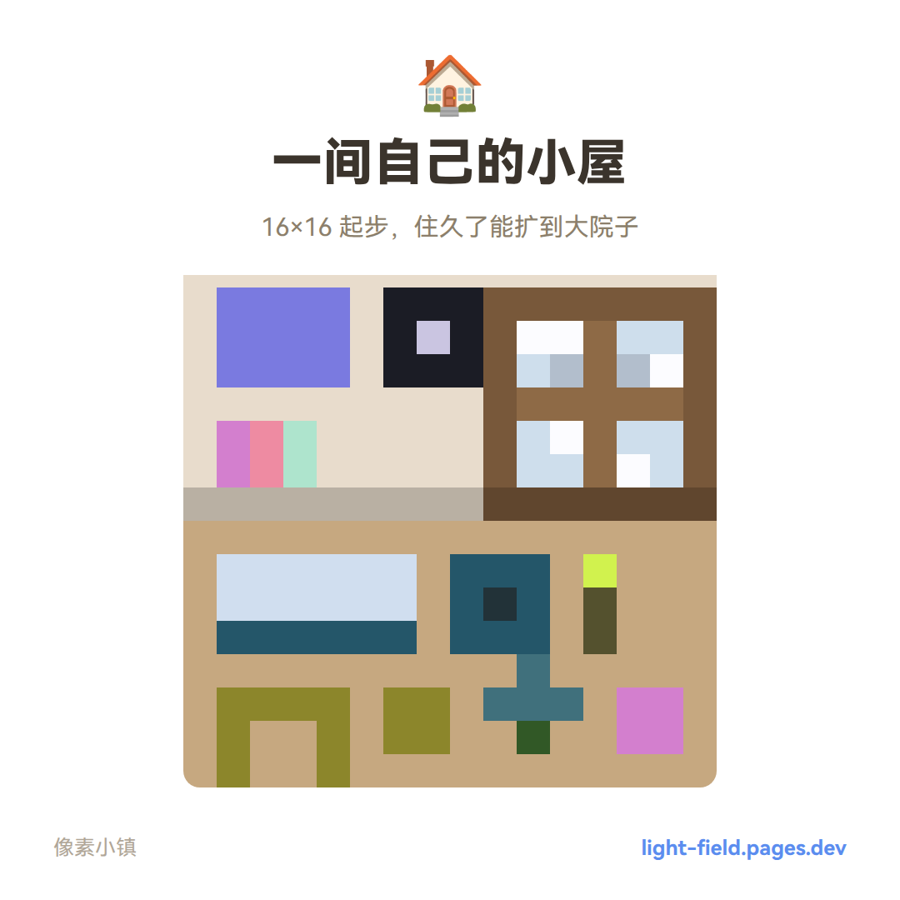
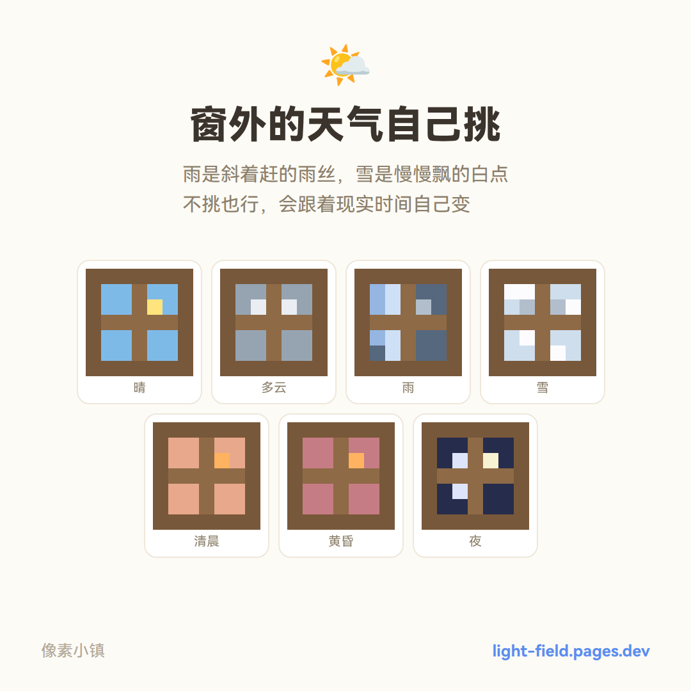
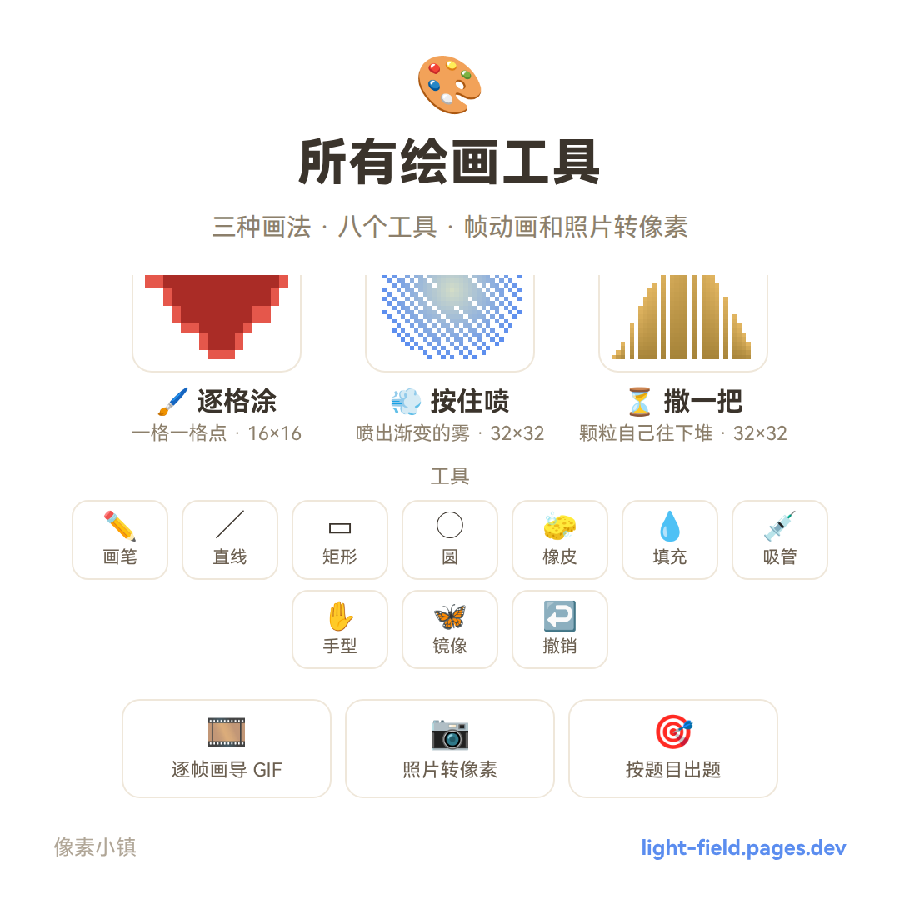
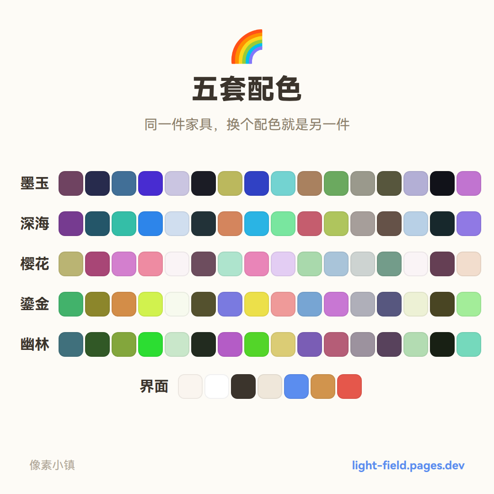
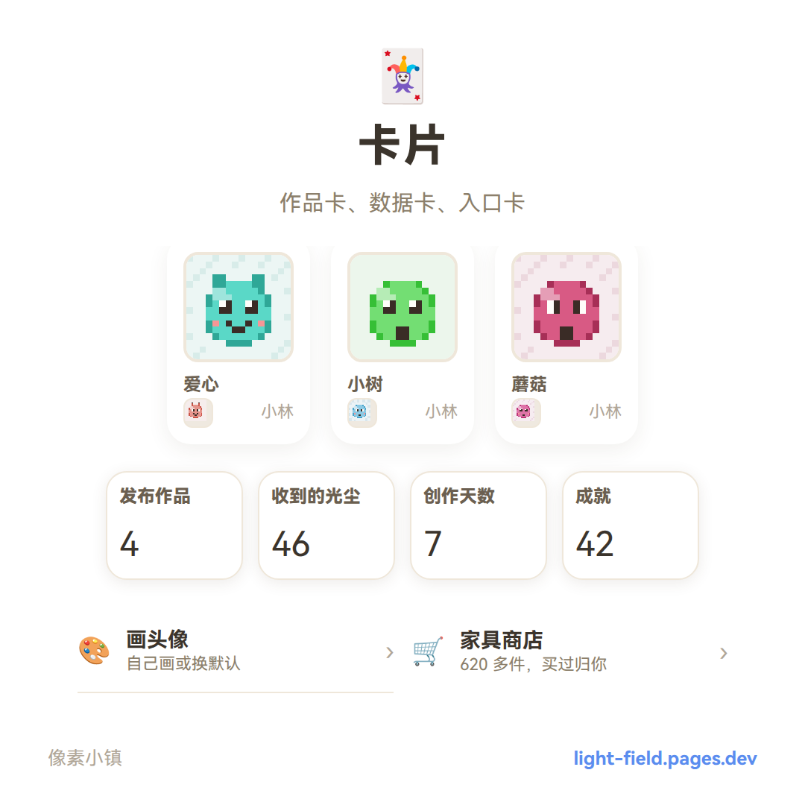
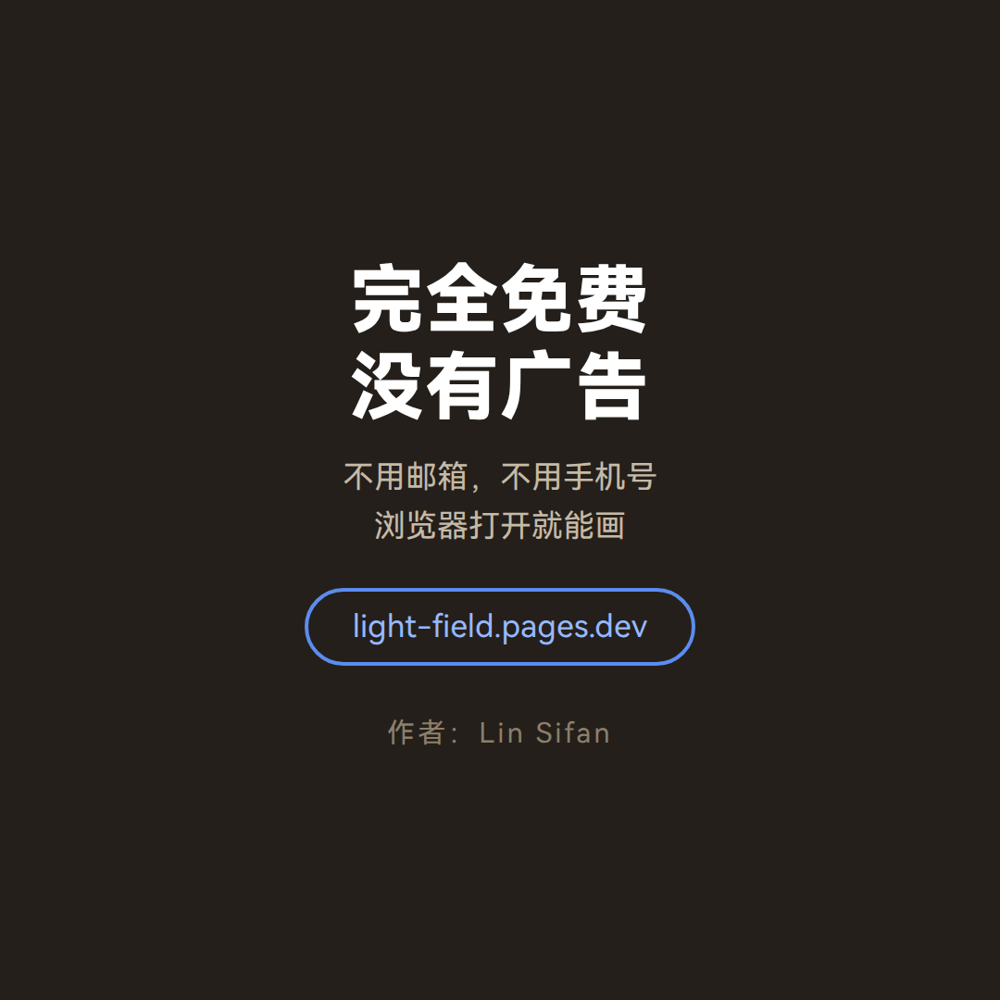

# 像素小镇

<div align="center">

[]()
[]()
[]()
[]()
[]()

</div>

一个挂在 Cloudflare Pages 上的像素画板小镇：画画、存档、展示，还有小镇串门、家具布置、卡牌闯关、好友聊天等一系列玩法。

同时支持 **ESP32-C3 + WS2812 灯板**硬件接入 —— 画板上的作品能实时投到 16×16 物理灯板上展示。

线上地址：<https://light-field.pages.dev>

详细文档见 [web/README.md](web/README.md)。

---

## 宣传图

### 手机长图

<p align="center">
  
</p>

### 朋友圈九宫格

<table align="center">
  <tr>
    <td></td>
    <td></td>
    <td></td>
  </tr>
  <tr>
    <td></td>
    <td></td>
    <td></td>
  </tr>
  <tr>
    <td></td>
    <td></td>
    <td></td>
  </tr>
</table>

---

## 特性

### 云端画板

- **三种创作模式**：像素画（逐格上色，含题目与帧动画）/ 像素喷漆（按住拖着喷）/ 像素重力（撒一把，看颗粒自己往下堆）
- **可切换画布尺寸**：16×16（默认）/ 32×32 / 64×64
- **作品名 / 作者名分开填**：单人标「作品名 + 一位作者」
- **本地草稿自动保存**：刷新 / 返回不丢失
- **作品库**：画板展示最新 10 条，画廊卡片流滚动懒加载（每页 24 张）
- **点赞 + 佳作展示**：Top 5 支持总榜 / 今日 / 本周切换
- **深色模式**：画板 / 画廊 / 房间三页可切换，记住偏好并跟随系统
- **一键回载**：浏览器本地记住本人上传的作品，可「载入编辑」继续画
- **键盘快捷键**：`B` 画笔 / `E` 橡皮 / `F` 填充 / `C` 颜色 / `Z` 撤销
- **自定义颜色**：支持输入 `#RRGGBB` 取色
- **分享单张**：`/gallery?t=<时间戳>` 直达并高亮
- **上传限流**：每 IP 5 分钟最多 1 次（429）
- **防抄袭**：仅可预览不可载入；内容完全相同拒绝重复（409）
- **历史容量**：最多 1000 条，超出自动删最旧

### 小镇玩法

- **小镇地图**：显示所有住户，点房子串门（只能看，动不了人家的东西）
- **我的小屋**：摆家具、贴墙纸、挑窗外天气
- **家具商店**：六百多件家具，光尘兑换
- **卡牌屋**：十层小塔，三选一扩牌
- **大锅饭**：给镇上的邻居做道菜端过去

### 社交系统

- **好友系统**：加好友、私信聊天
- **信箱**：接收系统通知和好友消息
- **关注 / 粉丝**：关注喜欢的画师，看他们的动态
- **个人主页**：展示作品、创作数据、成就

### 成长体系

- **光尘**：社区货币，点赞作品获得，可兑换家具
- **每日任务**：每天完成小任务赚光尘
- **成就系统**：解锁各种里程碑
- **排行榜**：作品榜、光尘榜
- **签到**：连续签到拿奖励

### 硬件灯板

- ESP32-C3 + 16×16 WS2812 灯板
- 每 2 分钟从云端拉取一张随机作品展示
- 光敏电阻自动调节亮度
- 蛇形走线坐标映射

---

## 技术栈

| 层级 | 技术 |
| --- | --- |
| 前端 | Vue 3 + Vue Router 4（全局构建版，无构建步骤） |
| 后端 | Cloudflare Pages Functions |
| 存储 | Cloudflare KV（`LIGHTFIELD_KV`） |
| 部署 | Cloudflare Pages（`git push` 即部署） |
| 硬件 | ESP32-C3 + WS2812B 16×16 灯板 + 光敏电阻 |

---

## 项目结构

```
像素小镇/
├── web/                    # 主项目：云端画板
│   ├── public/             #   前端静态文件（Vue SPA）
│   ├── functions/          #   Pages Functions（API 接口）
│   ├── tools/              #   辅助脚本（截图、测试、海报等）
│   └── README.md           #   Web 端详细文档
├── 光域.ino                # ESP32-C3 灯板固件（已停更，仅存档）
├── demo/                   # 灯板演示程序（存档）
├── 我的文档.md             # 嵌入式速查笔记（存档）
├── wifi_secret.example.h   # WiFi 配置模板（复制为 wifi_secret.h 后填入）
├── 电路图.png              # 硬件接线图
├── 展示图.jpg              # 实物展示图
└── 宣传图/                 # 宣传素材（不入库）
```

---

## 页面一览

| 路由 | 说明 |
| --- | --- |
| `/paint` | 画板主页（编辑 + 上传 + 最新 10 条） |
| `/gallery` | 全部作品卡片流（懒加载，可预览 + 点赞 + 分享） |
| `/town` | 小镇地图（串门、入口卡片） |
| `/town/home` | 个人小屋（摆家具、贴墙纸） |
| `/town/bag` | 家具商店 |
| `/town/card` | 卡牌屋 |
| `/town/hotpot` | 大锅饭 |
| `/mine` | 我的（作品、光尘、任务、成就） |
| `/chat` | 好友聊天 |
| `/mail` | 信箱 |
| `/u` | 画师主页 |
| `/rank` | 排行榜 |
| `/tasks` | 每日任务 |
| `/achieve` | 成就 |
| `/avatar` | 头像设置 |
| `/intro` | 个人信息 |
| `/settings` | 设置 |
| `/admin` | 管理后台（`x-admin-key` 校验） |
| `/terms` | 服务条款 |
| `/faq` | 常见问题 |

---

## 快速开始

### 云端画板（Web 端）

```sh
# 克隆仓库
git clone https://github.com/TuxLin123233/pixel-town.git
cd pixel-town/web

# 本地开发（需要 Wrangler CLI）
npx wrangler pages dev public
```

本地 KV 绑定见 `web/wrangler.toml` 注释，把 `id` 换成你的 KV namespace ID。

### 灯板固件（嵌入式端）

1. 安装 Arduino IDE + ESP32 开发板支持包
2. 安装依赖库：`FastLED`、`ArduinoJson`（WiFi / HTTPClient / esp_now 随 ESP32 核心自带）
3. 复制 `wifi_secret.example.h` 为 `wifi_secret.h`，填入你的 WiFi 信息
4. 打开 `光域.ino`，选择板子 **ESP32C3 Dev Module**，编译上传

---

## 部署配置（Cloudflare Pages 控制台）

- **Functions → Bindings**：添加 KV 绑定 `LIGHTFIELD_KV` → `lightfield`
- **环境变量**：`ADMIN_KEY`
- **构建**：Build command `true`、Root directory `web`、构建输出目录 `public`

---

## API

所有接口在 `web/functions/api/`，均为 Pages Functions。

| 接口 | 说明 |
| --- | --- |
| `POST /api/set` | 上传作品 |
| `GET /api/get` | 最新作品 + 历史（`?single=1` 随机一张，灯板用） |
| `POST /api/like` | 点赞 |
| `GET /api/like` | 按赞数 Top N（`range=today\|week\|all`） |
| `POST /api/admin/*` | 管理：`delete` / `clear` / `verify` |
| `GET /api/town` | 小镇数据（住户、地图） |
| `POST /api/town` | 小镇操作（布置小屋等） |
| `GET /api/dust` | 光尘余额 |
| `POST /api/follow` | 关注/取关 |
| `GET /api/chat` | 聊天消息 |
| `POST /api/chat` | 发送消息 |

---

## 文案语气

面向用户的文字统一按「**小镇里的人在说话**」来写，不要写成产品说明书。

- **要**：把用户当镇民、把网站当小镇；短句、口语；出错时说人话
- **不要**：说明文腔；排比对仗；每句都玩梗；为了亲切而含糊

详见 [web/README.md](web/README.md#文案语气)。

---

## 版本控制

- 本仓库为**像素小镇总仓库**：GitHub `TuxLin123233/pixel-town`
- 早期嵌入式端历史保留在 `realm` remote（`light-realm`）

---

## License

MIT
